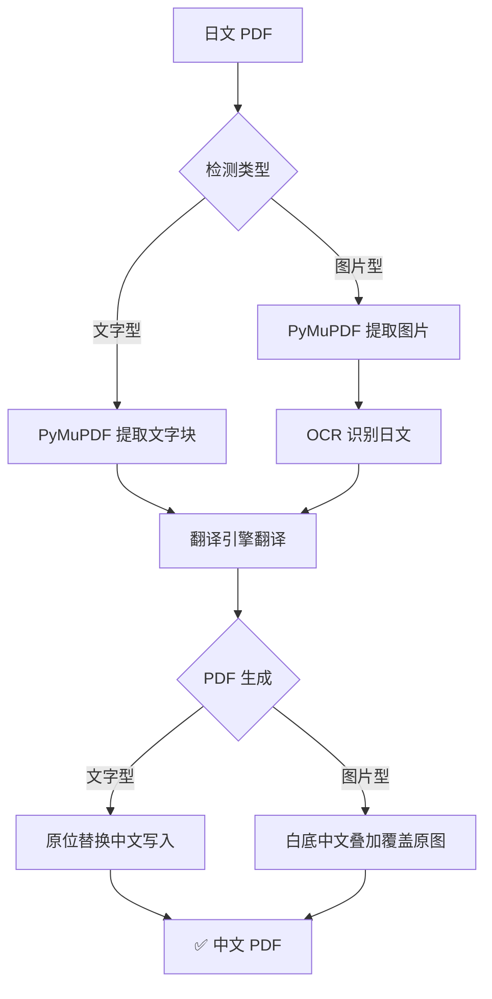

# 日文 PDF 翻译工具 🇯🇵 → 🇨🇳 （测试中）

将**多页日文 PDF** 翻译为中文，支持**文字型 PDF**和**图片型（扫描件）PDF**。

## ✨ 核心功能

| 特性 | 说明 |
|---|---|
| 🔤 **文字型 PDF** | PyMuPDF 提取文字 → 翻译 → 原位替换写入 |
| 🖼️ **图片型 PDF** | 提取图片 → OCR 识别日文 → 翻译 → 白底中文**叠加覆盖**原图 |
| 🌐 **四种翻译引擎** | Google(免费) / DeepSeek / OpenAI / DeepL |
| 🔍 **双 OCR 引擎** | EasyOCR(GPU加速) / Tesseract(CPU快速) |
| 🔄 **自动降级** | 下载失败自动重试5次、语言包缺失给出下载指引 |
| 📊 **进度可视化** | tqdm 进度条，错误不被遮盖 |

## 📁 项目结构

```text
japanese_pdf_translator/
├── main.py                 # 主程序入口
├── config.py               # 全局配置
├── requirements.txt        # Python 依赖
├── .env.example            # API Key 模板
├── modules/
│   ├── pdf_extractor.py    # PDF 文字/图片提取
│   ├── ocr_engine.py       # OCR 引擎 (自动重试+语言包检测)
│   ├── translator.py       # 翻译引擎 (Google/DeepSeek/OpenAI/DeepL)
│   └── pdf_generator.py    # PDF 生成 (文字替换 + 图片叠加两种模式)
├── input/                  # 放入待翻译的 PDF
├── output/                 # 翻译后的 PDF 输出
└── temp/                   # 临时文件 (自动清理)
```

## 🚀 快速开始

### 1. 安装依赖

```powershell
pip install -r requirements.txt
```

### 2. 基础使用

```powershell
# 最简单 — Google 翻译 + EasyOCR (首次需下载模型)
python main.py input/your_file.pdf

# 图片型 PDF 推荐 —  Tesseract
python main.py input/scanned.pdf --ocr tesseract

# 指定输出路径
python main.py input.pdf -o output/translated.pdf
```

### 3. 配置 API Key（推荐 DeepSeek）

复制 `.env.example` → `.env`，填入 Key：

```env
# DeepSeek 
DEEPSEEK_API_KEY=sk-your-key-here
W
# OpenAI (可选)
OPENAI_API_KEY=sk-your-key-here
```

> DeepSeek Key 获取: https://platform.deepseek.com/api_keys

### 4. 安装 Tesseract (Windows，处理图片型 PDF 推荐)

```powershell
# 1. 下载安装 Tesseract
#    https://github.com/UB-Mannheim/tesseract/wiki

# 2. 安装日语语言包（二选一）
#    方式A: 安装时勾选 Japanese
#    方式B: 手动下载 jpn.traineddata 放到 tessdata 目录
#           https://github.com/tesseract-ocr/tessdata/raw/main/jpn.traineddata

# 3. 验证安装
tesseract --list-langs
```

## 🔧 翻译引擎对比

| 引擎 | 免费 | 质量 | 速度 | 需要 |
| --- | --- | --- | --- | --- |
| **Google** | ✅ | ⭐⭐⭐ | 快 | 无（可能需代理） |
| **DeepSeek** | ❌(极便宜) | ⭐⭐⭐⭐ | 快 | API Key |
| **OpenAI** | ❌ | ⭐⭐⭐⭐⭐ | 中等 | API Key |
| **DeepL** | ❌ | ⭐⭐⭐⭐ | 快 | API Key |

## 🖼️ OCR 引擎对比

| 引擎 | 准确度 | 速度 | 安装 |
| --- | --- | --- | --- |
| **EasyOCR** | ⭐⭐⭐⭐ | 中等(GPU快) | pip install easyocr（首次需下载模型） |
| **Tesseract** | ⭐⭐⭐ | 快 | 需单独安装 + 语言包 |

> **图片型 PDF 推荐**: `--ocr tesseract`（无需下载模型，速度快）

## 📋 命令行参数

```text
python main.py <PDF文件> [选项]

选项:
  -o, --output PATH      输出 PDF 路径
  --translator ENGINE    翻译引擎: google | deepseek | openai | deepl
                         默认: google
  --ocr ENGINE           OCR 引擎: easyocr | tesseract
                         默认: easyocr
  --source-lang CODE     源语言 (默认: ja)
  --target-lang CODE     目标语言 (默认: zh-CN)
```

## 🔄 工作流程



## 🐛 常见问题

**Q: 输出 PDF 依旧是日语？**

你的 PDF 是图片型（扫描件）。程序会自动检测并切换到「图片叠加模式」。
确认 OCR 引擎工作正常（Tesseract 需日语语言包，EasyOCR 需下载模型）。

**Q: EasyOCR 下载模型失败？**

已内置自动重试（最多5次，指数退避）。全部失败后会给出手动下载指引。
国内用户可切换到 Tesseract: `--ocr tesseract`。

**Q: Tesseract 报 `jpn.traineddata` 找不到？**

需要安装日语语言包，程序会检测并给出下载地址。

**Q: DeepSeek API 调用失败？**

检查 `.env` 中 `DEEPSEEK_API_KEY` 是否正确，账户是否有余额。

**Q: 生成 PDF 卡住？**

图片型 PDF 图片多时（如391页），OCR+翻译+生成可能需要 5-15 分钟，
进度条会显示实时状态，请耐心等待。

**Q: 中文显示为方块？**

确保系统安装了中文字体（宋体/微软雅黑），或在 `.env` 中指定 `FONT_PATH`。

## 📄 License

MIT
