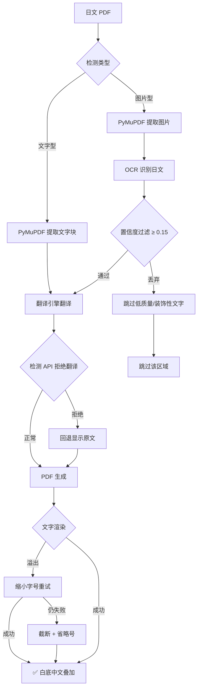

# 日文 PDF 翻译工具 🇯🇵 → 🇨🇳
（测试中）
将**多页日文 PDF** 自动翻译为简体中文，支持**文字型**和**图片型（扫描件）**PDF。

🖥️ **macOS** · **Windows** · **Linux** 全平台可用

---

## ✨ 核心功能

| 特性 | 说明 |
|---|---|
| 🔤 **文字型 PDF** | PyMuPDF 提取文字 → AI 翻译 → 原位替换写入 |
| 🖼️ **图片型 PDF** | 提取图片 → OCR 识别日文 → 翻译 → 白底中文叠加覆盖原图 |
| 🌐 **四种翻译引擎** | Google（免费）/ DeepSeek / OpenAI / DeepL |
| 🔍 **双 OCR 引擎** | EasyOCR（句级识别，GPU 加速）/ Tesseract（字级识别，CPU 快速） |
| 🛡️ **智能容错** | 置信度过滤 · 翻译拒绝检测 · 渲染重试 · 原文回退 |
| 🔄 **自动重试** | 模型下载失败自动重试 5 次（指数退避） |
| 📊 **进度可视化** | tqdm 进度条，警告不遮盖进度 |

---

## 📁 项目结构

```
ja2zh_pdf_translator/
├── main.py                 # 主程序入口
├── config.py               # 全局配置（跨平台自适应）
├── requirements.txt        # Python 依赖
├── .env                    # API Key 配置（需自行创建）
├── modules/
│   ├── pdf_extractor.py    # PDF 文字/图片提取（保留位置信息）
│   ├── ocr_engine.py       # OCR 引擎（EasyOCR + Tesseract，自动检测语言包）
│   ├── translator.py       # 翻译引擎（Google / DeepSeek / OpenAI / DeepL）
│   └── pdf_generator.py    # PDF 生成（文字替换 + 图片叠加，三级回退渲染）
├── input/                  # ← 把待翻译的 PDF 放这里
├── output/                 # ← 翻译后的 PDF 输出在这里
└── temp/                   # 临时文件（可手动清理）
```

---

## 🚀 快速开始

### 1. 安装 Python 依赖

```bash
pip install -r requirements.txt
```

### 2. 配置 API Key

在项目根目录创建 `.env` 文件：

```env
# DeepSeek（推荐，约 ¥0.5~1 翻译一本 300 页轻小说）
DEEPSEEK_API_KEY=sk-your-deepseek-key

# OpenAI（可选）
OPENAI_API_KEY=sk-your-openai-key
```

> 🔑 [免费注册 DeepSeek 获取 Key](https://platform.deepseek.com/api_keys)

### 3. 运行

```bash
# 默认配置：DeepSeek 翻译 + EasyOCR（首次自动下载约 100MB 模型）
python main.py input/your_file.pdf

# 指定输出路径
python main.py input/your_file.pdf -o output/result.pdf

# 免费方案：Google 翻译 + EasyOCR
python main.py input/your_file.pdf --translator google

# 极速方案：DeepSeek + Tesseract（需先安装 Tesseract）
python main.py input/your_file.pdf --translator deepseek --ocr tesseract
```

---

## 🖥️ 各平台安装指南

### 🍎 macOS

```bash
# EasyOCR —— 无需额外安装（首次运行自动下载模型）

# Tesseract（可选）
brew install tesseract tesseract-lang

# 修复 Python 3.12 SSL 证书（如遇下载报错）
/Applications/Python\ 3.12/Install\ Certificates.command

# 中文字体：自动检测 STHeiti → Songti（系统自带）
```

### 🪟 Windows

```powershell
# Tesseract（可选）
# 1. 下载安装：https://github.com/UB-Mannheim/tesseract/wiki
# 2. 安装时勾选 Japanese 语言包
# 3. 验证：tesseract --list-langs

# 中文字体：自动检测 SimSun → Microsoft YaHei
```

### 🐧 Linux

```bash
# Tesseract（可选）
sudo apt install tesseract-ocr tesseract-ocr-jpn

# 中文字体
sudo apt install fonts-noto-cjk
```

---

## 📋 完整命令参考

```text
python main.py <PDF文件> [选项]

选项:
  -o, --output PATH      输出 PDF 路径
  --translator ENGINE    翻译引擎: deepseek(默认) | google | openai | deepl
  --ocr ENGINE           OCR 引擎: easyocr(默认) | tesseract
  --source-lang CODE     源语言 (默认: ja)
  --target-lang CODE     目标语言 (默认: zh-CN)
```

**实测可用命令（macOS）：**

```bash
# ① 默认 —— DeepSeek + EasyOCR（推荐，翻译质量最好）
python main.py input/your_file.pdf

# ② 免费 —— Google + EasyOCR
python main.py input/your_file.pdf --translator google

# ③ 极速 —— DeepSeek + Tesseract（需 brew install tesseract tesseract-lang）
python main.py input/your_file.pdf --ocr tesseract

# ④ 指定输出
python main.py input/your_file.pdf -o output/my_translated.pdf

# ⑤ OpenAI 最高质量
python main.py input/your_file.pdf --translator openai
```

---

## 🔧 翻译引擎对比

| 引擎 | 费用 | 日→中质量 | 速度 | 需要 |
|------|------|-----------|------|------|
| **DeepSeek** | ≈ ¥0.5~1/300页 | ⭐⭐⭐⭐ | 快 | [API Key](https://platform.deepseek.com/api_keys) |
| **Google** | 免费 | ⭐⭐⭐ | 快 | 无需配置 |
| **OpenAI** | ≈ ¥3~5/300页 | ⭐⭐⭐⭐⭐ | 中等 | API Key |
| **DeepL** | 按量付费 | ⭐⭐⭐⭐ | 快 | API Key |

---

## 🔍 OCR 引擎对比（实测 391 页轻小说）

| | EasyOCR | Tesseract |
|------|---------|------------|
| **识别粒度** | 🟢 句子级（保持上下文） | 🔴 单字级（拆散语义） |
| **第 5 页实测** | 17 区 → 10 条有效翻译 | 57 区 → 7 条有效翻译 |
| **翻译可用率** | ≈ 59% | ≈ 12% |
| **速度（单页）** | ≈ 12s（GPU） / ≈ 25s（CPU） | ≈ 3s |
| **GPU 加速** | ✅ macOS MPS / CUDA | ❌ 纯 CPU |
| **安装** | pip 安装，自动下载模型 | 需系统安装 + 语言包 |

> 💡 **结论：轻小说/漫画类 PDF 推荐 EasyOCR**，因为它能保持句子结构，翻译质量显著优于 Tesseract。
> Tesseract 适合纯文字文档扫描件（速度快，但对日文上下文识别较弱）。

---

## 🔄 工作流程



---

## ⚙️ .env 配置参考

```env
# === 翻译引擎 ===
DEEPSEEK_API_KEY=sk-your-key    # DeepSeek（默认引擎）
OPENAI_API_KEY=sk-your-key      # OpenAI
DEEPL_API_KEY=your-key          # DeepL

# === OCR 引擎 ===
# Tesseract 路径（通常自动检测，无需设置）
# TESSERACT_CMD=/opt/homebrew/bin/tesseract

# === PDF 输出 ===
# 中文字体路径（自动检测，也可手动指定）
# FONT_PATH=/System/Library/Fonts/STHeiti Light.ttc
```

---

## 🐛 常见问题

### Q: 翻译后只有白色方块，没有中文？

✅ 已修复（v2.0）。现在渲染失败会**自动缩字号重试**，仍失败则**灰度显示原文**，杜绝空白白条。

### Q: EasyOCR vs Tesseract 怎么选？

- 📖 **轻小说 / 漫画 / 图文混排**：用 EasyOCR（句子级识别 + GPU 加速）
- 📄 **纯文字扫描件**：用 Tesseract（速度快）

### Q: 前几页翻译效果很差？

正常现象。封面/插图使用装饰性字体，OCR 识别率本身很低。内容页（第 5 页起）翻译效果正常。

### Q: 翻译返回"请提供需要翻译的日语文本"？

DeepSeek 对 OCR 乱码会拒绝翻译。新版本自动检测并**回退显示原文**，不会留空白。

### Q: EasyOCR 下载模型失败？

- **macOS**：运行 `Install Certificates.command` 修复 SSL 证书
- **备选**：切换到 Tesseract `--ocr tesseract`
- **手动**：下载模型到 `~/.EasyOCR/model/`

### Q: Tesseract 缺少日语语言包？

- **macOS**：`brew install tesseract-lang`
- **Windows**：安装时勾选 Japanese，或下载 [jpn.traineddata](https://github.com/tesseract-ocr/tessdata/raw/main/jpn.traineddata)
- **Linux**：`sudo apt install tesseract-ocr-jpn`

### Q: 中文显示为方块/乱码？

程序会自动检测系统中文字体：
- **macOS** → STHeiti / Songti（系统自带）
- **Windows** → SimSun / Microsoft YaHei
- 手动指定：在 `.env` 中设置 `FONT_PATH`

### Q: 300 多页 PDF 要跑多久？

| 配置 | 预估时间 |
|------|----------|
| EasyOCR + DeepSeek | 1 ~ 3 小时 |
| Tesseract + DeepSeek | 30 ~ 60 分钟 |
| EasyOCR + Google | 1 ~ 2 小时 |

---

## 📄 License

MIT
