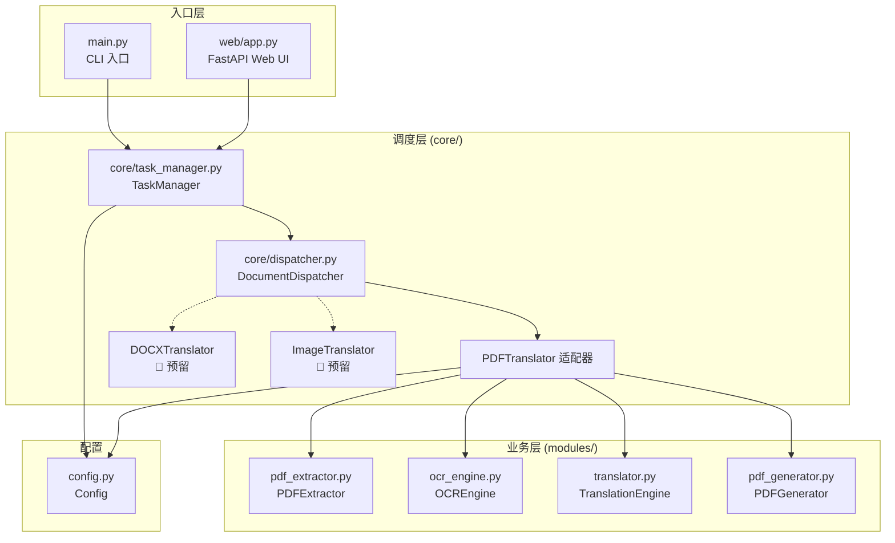
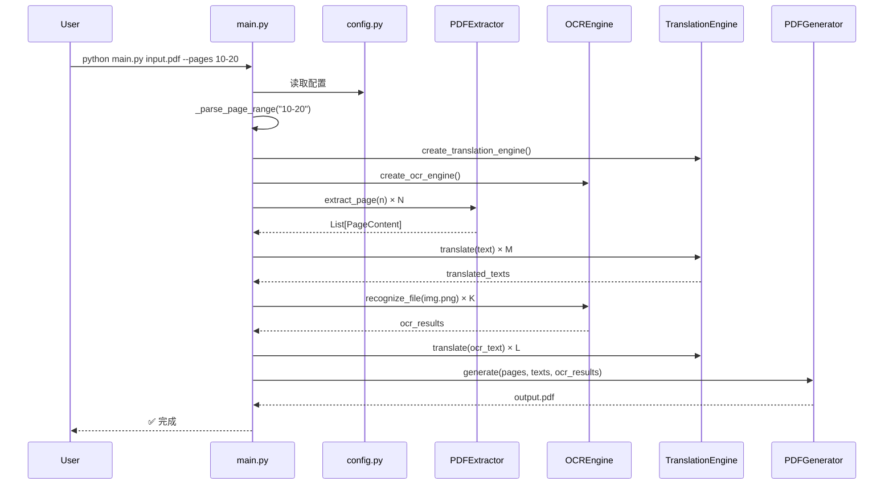
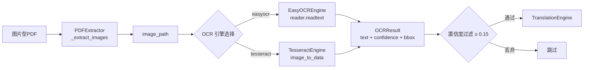
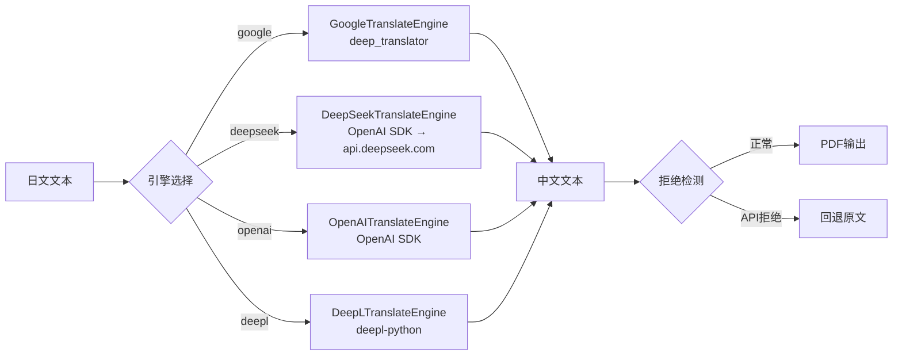
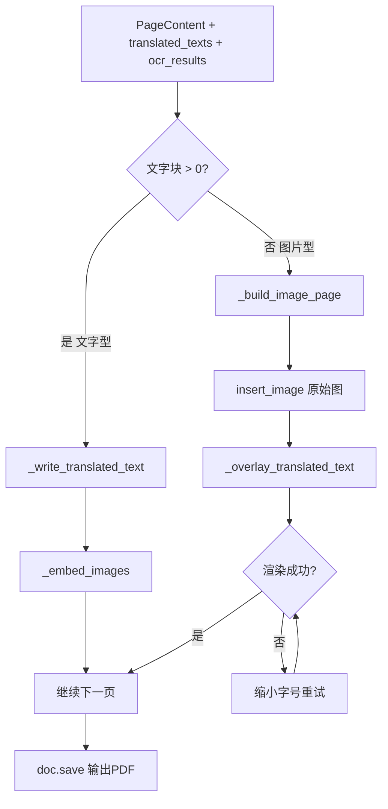
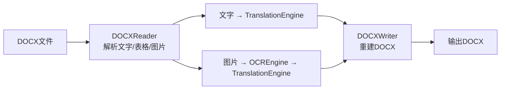
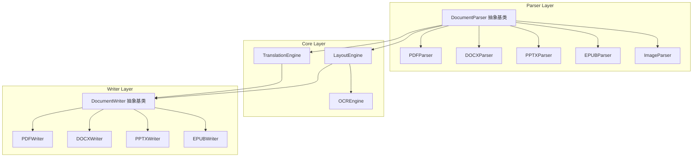

# ARCHITECTURE.md — 项目架构

## 📁 目录结构

```
ja2zh_pdf_translator/
├── main.py                 # CLI 入口 + JapanesePDFTranslator 主类
├── config.py               # Config 全局配置类
├── requirements.txt        # Python 依赖
├── .env                    # API Key（gitignore）
├── docs/                   # 项目文档
│   ├── PROJECT_SPEC.md
│   ├── ARCHITECTURE.md
│   ├── ROADMAP.md
│   ├── TASKS.md
│   ├── DESIGN.md
│   ├── CHANGELOG.md
│   ├── DEVELOPMENT_PLAN.md
│   └── README_DEVELOPMENT.md
├── core/                   # 🆕 核心调度层（Phase 2 Step 2）
│   ├── __init__.py
│   ├── task_manager.py     # TaskManager — 统一任务管理
│   └── dispatcher.py       # DocumentDispatcher — 格式分派
├── web/                    # 🆕 Web UI（Phase 2 Step 1）
│   ├── app.py              # FastAPI 应用
│   ├── templates/
│   │   └── index.html
│   └── static/
│       ├── style.css
│       └── app.js
├── modules/
│   ├── __init__.py
│   ├── pdf_extractor.py    # PDFExtractor + PageContent/TextBlock/ImageBlock
│   ├── ocr_engine.py       # OCREngine + EasyOCREngine + TesseractEngine
│   ├── translator.py       # TranslationEngine + 4 种引擎实现
│   ├── pdf_generator.py    # PDFGenerator + SimplePDFGenerator
│   └── docx_reader.py      # 🆕 DocxReader + DocxContent（Phase 4 Step 1）
├── input/                  # 待翻译的文件
├── output/                 # 翻译后的文件
└── temp/                   # 临时文件（图片等）
```

---

## 🏗️ 模块关系 Mermaid 图



    extractor --> |PageContent| main
    ocr --> |OCRResult| main
    translator --> |translated text| main
    main --> |数据| generator

    subgraph "数据模型"
        PageContent
        TextBlock
        ImageBlock
        OCRResult
    end

    extractor -.-> |使用| PageContent
    extractor -.-> |使用| TextBlock
    extractor -.-> |使用| ImageBlock
    ocr -.-> |生成| OCRResult
```

---

## 🔄 调用流程图



---

## 🔍 OCR 调用链



---

## 🌐 Translation 调用链



---

## 📄 PDF 输出流程



---

## 🔮 未来架构（Phase 2+）

### 未来 DOCX 流程



### 未来统一 Parser 架构


