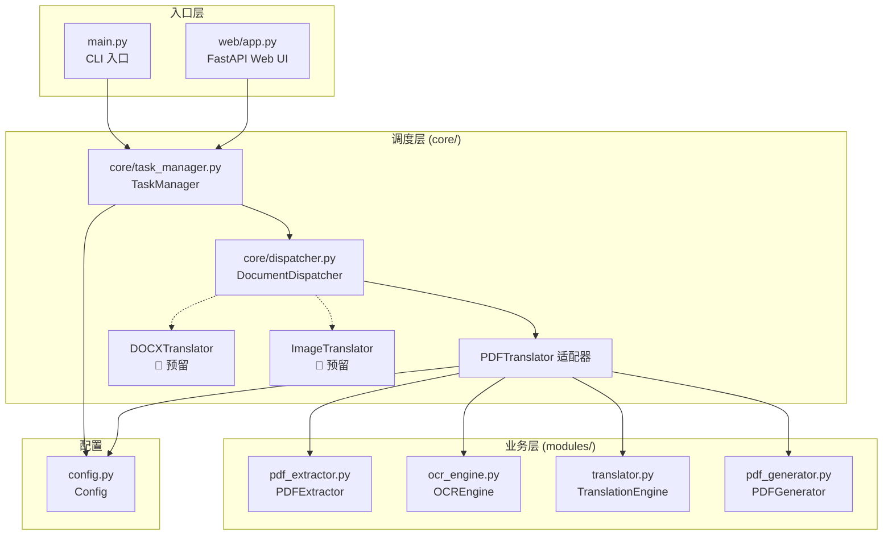
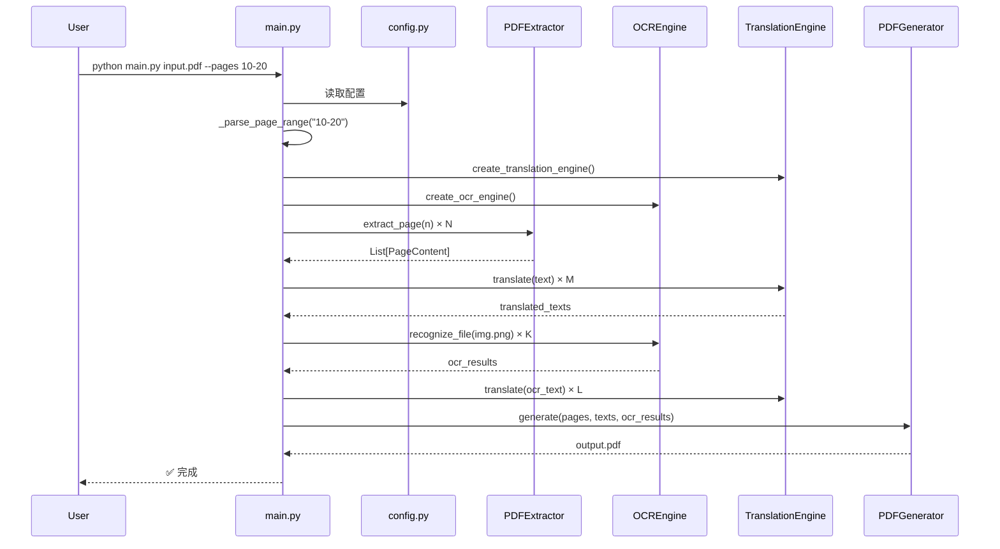
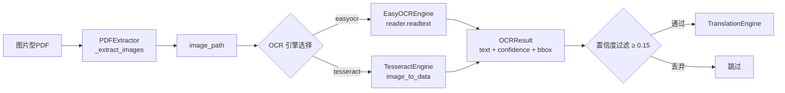
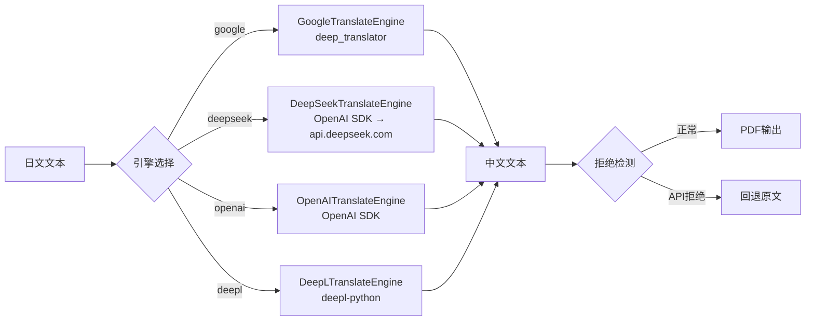
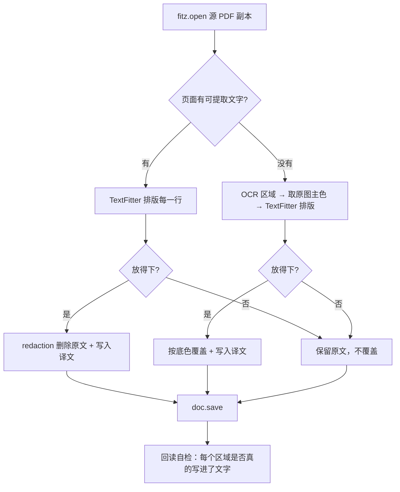
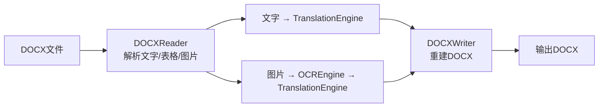
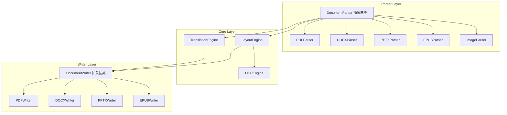

# ARCHITECTURE.md — 项目架构

## 📁 目录结构

```
ja2zh_pdf_translator/
├── main.py                 # CLI 入口 + JapanesePDFTranslator 主类
├── config.py               # Config 全局配置类
├── requirements.txt        # Python 依赖
├── .env                    # API Key（gitignore）
├── docs/                   # 项目文档
│   ├── PROJECT_SPEC.md
│   ├── ARCHITECTURE.md
│   ├── ROADMAP.md
│   ├── TASKS.md
│   ├── DESIGN.md
│   ├── CHANGELOG.md
│   ├── DEVELOPMENT_PLAN.md
│   └── README_DEVELOPMENT.md
├── core/                   # 🆕 核心调度层（Phase 2 Step 2）
│   ├── __init__.py
│   ├── task_manager.py     # TaskManager — 统一任务管理
│   └── dispatcher.py       # DocumentDispatcher — 格式分派
├── web/                    # 🆕 Web UI（Phase 2 Step 1）
│   ├── app.py              # FastAPI 应用
│   ├── templates/
│   │   └── index.html
│   └── static/
│       ├── style.css
│       └── app.js
├── modules/
│   ├── __init__.py
│   ├── pdf_extractor.py    # PDFExtractor + PageContent/TextBlock/ImageBlock（逐行 bbox）
│   ├── ocr_engine.py       # OCREngine + EasyOCREngine + TesseractEngine（GPU 自动 + 缓存）
│   ├── translator.py       # TranslationEngine + 5 种引擎（批量 + 缓存 + 重试）
│   ├── text_layout.py      # 🆕 TextFitter — 测宽/换行/自适应字号（防空白的关键）
│   ├── pdf_generator.py    # 🆕 在原 PDF 副本上写入译文（redaction / 底色覆盖）
│   ├── image_overlay.py    # 🆕 DOCX 内嵌图片译文重绘
│   ├── fonts.py            # 🆕 中文字体发现 + 字形覆盖校验
│   ├── utils.py            # 🆕 页码范围解析 / 缓存键 / 进度回调
│   ├── docx_reader.py      # DocxReader + DocxContent
│   └── docx_writer.py      # DocxWriter（保留样式写回）
├── tools/
│   └── verify_pipeline.py  # 🆕 端到端自检（空白/底色/溢出/墨量）
├── .cache/                 # OCR 与翻译缓存
├── input/                  # 待翻译的文件
├── output/                 # 翻译后的文件
└── temp/                   # 临时文件（图片等）
```

---

## 🏗️ 模块关系 Mermaid 图


```mermaid
graph TD
    subgraph "入口层"
        CLI[main.py<br/>CLI 入口]
        Web[web/app.py<br/>FastAPI Web UI]
    end

    subgraph "调度层 (core/)"
        TM[core/task_manager.py<br/>TaskManager]
        DP[core/dispatcher.py<br/>DocumentDispatcher]
        PDFT[PDFTranslator 适配器]
        DOCXT[DOCXTranslator<br/>📌 预留]
        IMGT[ImageTranslator<br/>📌 预留]
    end

    subgraph "业务层 (modules/)"
        EXT[pdf_extractor.py<br/>PDFExtractor]
        OCR[ocr_engine.py<br/>OCREngine]
        TR[translator.py<br/>TranslationEngine]
        GEN[pdf_generator.py<br/>PDFGenerator]
    end

    subgraph "配置"
        CFG[config.py<br/>Config]
    end

    CLI --> TM
    Web --> TM
    TM --> DP
    DP --> PDFT
    DP -.-> DOCXT
    DP -.-> IMGT
    PDFT --> EXT
    PDFT --> OCR
    PDFT --> TR
    PDFT --> GEN
    TM --> CFG
    PDFT --> CFG
```

> v0.3 起 `DP` 直接委托 `core/pdf_translator.PDFTranslator` 与
> `core/docx_translator.DOCXTranslator`；`core/dispatcher.py` 里只保留
> 「按扩展名分派」的适配层。

    extractor --> |PageContent| main
    ocr --> |OCRResult| main
    translator --> |translated text| main
    main --> |数据| generator

    subgraph "数据模型"
        PageContent
        TextBlock
        ImageBlock
        OCRResult
    end

    extractor -.-> |使用| PageContent
    extractor -.-> |使用| TextBlock
    extractor -.-> |使用| ImageBlock
    ocr -.-> |生成| OCRResult
```

---

## 🔄 调用流程图


```mermaid
sequenceDiagram
    participant User
    participant CLI as main.py
    participant Config as config.py
    participant Extractor as PDFExtractor
    participant OCR as OCREngine
    participant Translator as TranslationEngine
    participant Generator as PDFGenerator

    User ->> CLI: python main.py input.pdf --pages 10-20
    CLI ->> Config: 读取配置
    CLI ->> CLI: _parse_page_range("10-20")

    CLI ->> Translator: create_translation_engine()
    CLI ->> OCR: create_ocr_engine()

    CLI ->> Extractor: extract_page(n) × N
    Extractor -->> CLI: List[PageContent]

    CLI ->> Translator: translate(text) × M
    Translator -->> CLI: translated_texts

    CLI ->> OCR: recognize_file(img.png) × K
    OCR -->> CLI: ocr_results
    CLI ->> Translator: translate(ocr_text) × L

    CLI ->> Generator: generate(pages, texts, ocr_results)
    Generator -->> CLI: output.pdf

    CLI -->> User: ✅ 完成
```

---

## 🔍 OCR 调用链


```mermaid
flowchart LR
    A[图片型PDF] --> B[PDFExtractor<br/>_extract_images]
    B --> C[image_path]
    C --> D{OCR 引擎选择}
    D -->|easyocr| E[EasyOCREngine<br/>reader.readtext]
    D -->|tesseract| F[TesseractEngine<br/>image_to_data]
    E --> G[OCRResult<br/>text + confidence + bbox]
    F --> G
    G --> H{置信度过滤 ≥ 0.15}
    H -->|通过| I[TranslationEngine]
    H -->|丢弃| J[跳过]
```

---

## 🌐 Translation 调用链


```mermaid
flowchart LR
    A[日文文本] --> B{引擎选择}
    B -->|google| C[GoogleTranslateEngine<br/>deep_translator]
    B -->|deepseek| D[DeepSeekTranslateEngine<br/>OpenAI SDK → api.deepseek.com]
    B -->|openai| E[OpenAITranslateEngine<br/>OpenAI SDK]
    B -->|deepl| F[DeepLTranslateEngine<br/>deepl-python]
    C --> G[中文文本]
    D --> G
    E --> G
    F --> G
    G --> H{拒绝检测}
    H -->|正常| I[PDF输出]
    H -->|API拒绝| J[回退原文]
```

---

## 📄 PDF 输出流程（v0.3 重构后）


```mermaid
flowchart TD
    A[fitz.open 源 PDF 副本] --> B{页面有可提取文字?}
    B -->|有| C[TextFitter 排版每一行]
    B -->|没有| D[OCR 区域 → 取原图主色 → TextFitter 排版]
    C --> E{放得下?}
    D --> F{放得下?}
    E -->|是| G[redaction 删除原文 + 写入译文]
    E -->|否| H[保留原文，不覆盖]
    F -->|是| I[按底色覆盖 + 写入译文]
    F -->|否| H
    G --> J[doc.save]
    I --> J
    H --> J
    J --> K[回读自检：每个区域是否真的写进了文字]
```

> 旧流程（已废弃）：新建空白页 → 画白底 → `insert_textbox` 试写 →
> 写不进去就留下白块。这正是「翻译后图片大部分是空白」的根因。

---

## 🔮 未来架构（Phase 2+）

### 未来 DOCX 流程


```mermaid
flowchart LR
    A[DOCX文件] --> B[DOCXReader<br/>解析文字/表格/图片]
    B --> C[文字 → TranslationEngine]
    B --> D[图片 → OCREngine → TranslationEngine]
    C --> E[DOCXWriter<br/>重建DOCX]
    D --> E
    E --> F[输出DOCX]
```

### 未来统一 Parser 架构


```mermaid
flowchart TD
    subgraph "Parser Layer"
        P[DocumentParser 抽象基类]
        P1[PDFParser]
        P2[DOCXParser]
        P3[PPTXParser]
        P4[EPUBParser]
        P5[ImageParser]
        P --> P1
        P --> P2
        P --> P3
        P --> P4
        P --> P5
    end

    subgraph "Core Layer"
        OCR[OCREngine]
        TL[TranslationEngine]
        LE[LayoutEngine]
    end

    subgraph "Writer Layer"
        W[DocumentWriter 抽象基类]
        W1[PDFWriter]
        W2[DOCXWriter]
        W3[PPTXWriter]
        W4[EPUBWriter]
        W --> W1
        W --> W2
        W --> W3
        W --> W4
    end

    P --> LE --> OCR
    P --> TL
    LE --> W
    TL --> W
```
