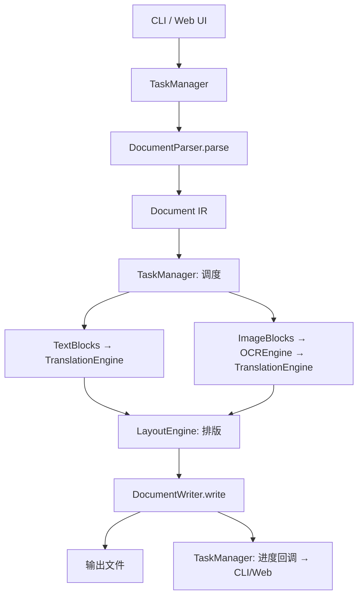

# DESIGN.md — 设计决策记录

## 1. 为什么拆模块？

**现状**：5 个文件，模块职责清晰。
- `main.py` → 流程编排（不处理具体逻辑）
- `pdf_extractor.py` → 只负责"从 PDF 取出数据"
- `ocr_engine.py` → 只负责"图片→文字"
- `translator.py` → 只负责"日文→中文"
- `pdf_generator.py` → 只负责"数据→新PDF"

**原因**：
✅ 单一职责原则 — 每个模块只做一件事
✅ 可测试 — 每个模块可独立单元测试
✅ 可替换 — 换 OCR 引擎不影响翻译、不影响 PDF 生成
✅ 可复用 — OCR 模块可被 DOCX Reader 复用

---

## 2. 为什么选择工厂模式？

`create_ocr_engine()` 和 `create_translation_engine()` 使用简单工厂模式：
- 调用方不需要知道具体实现类
- 通过 `config.py` 或 CLI 参数切换引擎
- 新增引擎只需：实现基类 + 在工厂函数添加一个 `elif`

---

## 3. 为什么用 dataclass 做数据结构？

`PageContent`、`TextBlock`、`ImageBlock`、`OCRResult` 都是纯数据载体：
- 简洁、无样板代码
- 类型安全（配合 Type Hints）
- 易于序列化（未来可转 JSON 给 Web UI）

---

## 4. PDF 生成为什么用 PyMuPDF 而非 reportlab？

| 方案 | 优点 | 缺点 |
|------|------|------|
| **PyMuPDF（当前）** | 保留原始 PDF 版式、元数据、精准坐标 | 需要嵌入字体 |
| reportlab | 纯 Python、跨平台好 | 完全重新排版，版式丢失 |

**决策**：保留 PyMuPDF 为主方案，`SimplePDFGenerator` 作为备选（纯文字文档用）。

---

## 5. 为什么 OCR 和 Translation 完全独立？

**关键设计**：OCR 模块**不知道** Translation 的存在，Translation 模块**不知道** OCR 的存在。它们的协调在 `main.py` 的 `JapanesePDFTranslator` 中完成。

**好处**：
- OCR 可用于非翻译场景（如文字提取）
- Translation 可用于非 PDF 场景（如 DOCX 翻译）
- 未来换了格式（DOCX/PPTX/EPUB），OCR 和 Translation 代码**零修改**

---

## 6. 未来如何支持 PPTX？

```
PPTX → PPTXParser → 提取文字块（幻灯片文本框）
                  → 提取图片 → OCREngine → TranslationEngine
     → PPTXWriter → 替换文字 → 保持版式
                  → 嵌入 OCR 翻译结果到图片位置
```

**复用**：OCREngine（零修改）、TranslationEngine（零修改）
**新增**：`modules/pptx_reader.py`、`modules/pptx_writer.py`
**修改**：`main.py` 添加 Parser 路由

---

## 7. 未来如何支持 EPUB？

```
EPUB → EPUBParser → 提取 HTML/XHTML 内容
                  → 提取图片 → OCREngine → TranslationEngine
     → EPUBWriter → 替换 HTML 内容
                  → 保持 CSS 样式
```

**复用**：OCREngine（零修改）、TranslationEngine（零修改）
**新增**：`modules/epub_reader.py`、`modules/epub_writer.py`

---

## 8. 为什么选择当前架构（而非微服务）？

| 方案 | 适用场景 |
|------|----------|
| 单体 Python（当前） | 本地工具、个人使用、< 10 并发 |
| 微服务 | 企业平台、高并发、多租户 |

**决策**：保持单体。目标用户是个人，本地运行，无需分布式。

---

## 9. OCR 模块的容错设计

EasyOCREngine 有 5 次自动重试（指数退避），原因：
- 国内用户下载 EasyOCR 模型（~100MB）不稳定
- 下载中断的临时文件会被自动清理（`_clean_partial_downloads`）
- 所有重试失败后给出清晰的手动下载指引

---

## 10. PDF 图片叠加的三级回退策略

```
尝试 1: 正常字号渲染翻译文字
    ↓ 失败
尝试 2: 缩小字号 75% 再渲染
    ↓ 失败
尝试 3: 截断文本 + 省略号
    ↓ 失败
回退: 用灰色原文填充（避免空白白条）
```

**原因**：不同图片中的文字区域大小差异巨大，固定字号必然失败。三级回退确保"最差情况也有原文可看"。

---

## 11. DeepSeek 为什么是默认引擎？

| 因素 | DeepSeek | Google | OpenAI | DeepL |
|------|----------|--------|--------|-------|
| 费用 | ¥0.5~1/300页 | 免费 | ¥3~5/300页 | 按量 |
| 日→中质量 | ⭐⭐⭐⭐ | ⭐⭐⭐ | ⭐⭐⭐⭐⭐ | ⭐⭐⭐⭐ |
| 需要注册 | 是 | 否 | 是 | 是 |
| 国内速度 | 快 | 慢（需代理）| 慢（需代理）| 慢（需代理）|

**决策**：DeepSeek 在国内速度快、价格低、质量好 → 默认首选。

---

## 12. 新统一架构设计（Phase 2+）

### 设计目标

将项目从"PDF 翻译工具"演进为"多格式文档翻译平台"，核心原则：
- **Parser 层**：不同格式 → 统一数据结构（`Document`）
- **OCR 层**：完全独立，任何 Parser 可调用
- **Translation 层**：完全独立，任何 Parser 可调用
- **Layout 层**：统一排版引擎，处理文字排版/图片叠加
- **Writer 层**：统一数据结构 → 不同格式输出
- **Task Manager**：统一任务调度，供 CLI 和 Web UI 共用
- **CLI / Web UI**：只是不同的入口，共享同一个核心

### 统一数据结构

```python
@dataclass
class Document:
    """统一的文档中间表示（IR）"""
    source_path: str
    source_format: str  # "pdf" | "docx" | "pptx" | "epub" | "png" | "jpg"
    pages: List[Page] = field(default_factory=list)

@dataclass
class Page:
    page_index: int
    width: float
    height: float
    text_blocks: List[TextBlock] = field(default_factory=list)
    image_blocks: List[ImageBlock] = field(default_factory=list)

@dataclass
class TextBlock:
    text: str
    bbox: Tuple[float, float, float, float]
    font_size: float = 10.0
    font_name: str = ""
    style: Dict = field(default_factory=dict)  # bold, italic, color...

@dataclass
class ImageBlock:
    image: Any  # PIL.Image or file path
    bbox: Tuple[float, float, float, float]
    ocr_texts: List[OCRResult] = field(default_factory=list)
    translated_texts: List[Dict] = field(default_factory=list)
```

### Parser 层接口

```python
class DocumentParser(ABC):
    """文档解析器抽象基类"""
    @abstractmethod
    def parse(self, file_path: str) -> Document:
        """解析文件 → 统一 Document IR"""
        ...

class PDFParser(DocumentParser): ...
class DOCXParser(DocumentParser): ...
class PPTXParser(DocumentParser): ...
class EPUBParser(DocumentParser): ...
class ImageParser(DocumentParser): ...
```

### Writer 层接口

```python
class DocumentWriter(ABC):
    """文档生成器抽象基类"""
    @abstractmethod
    def write(self, document: Document, output_path: str) -> str:
        """统一 Document IR → 输出文件"""
        ...

class PDFWriter(DocumentWriter): ...
class DOCXWriter(DocumentWriter): ...
class PPTXWriter(DocumentWriter): ...
class EPUBWriter(DocumentWriter): ...
```

### Task Manager

```python
class TaskManager:
    """统一任务管理器 — CLI 和 Web UI 共用"""
    def create_task(self, source: str, options: TaskOptions) -> str:
        """创建翻译任务，返回 task_id"""
        ...

    def get_progress(self, task_id: str) -> TaskProgress:
        """获取任务进度（0-100, 当前步骤, 日志行）"""
        ...

    def run(self, task_id: str):
        """执行翻译任务（同步/异步）"""
        ...
```

### 核心流程（统一后）



### 扩展新格式只需

1. 实现 `DocumentParser` 子类（~200 行）
2. 实现 `DocumentWriter` 子类（~300 行）
3. 在 `TaskManager` 注册新格式（~5 行）
4. OCR / Translation / Layout Engine **零修改**

---

## 13. Web UI 设计（记录到设计，待实现）

### 技术选型

| 方案 | 优点 | 缺点 |
|------|------|------|
| FastAPI + Jinja2 | 高性能、WebSocket 原生支持、Python 全栈 | 前端需自己写 |
| Flask + Jinja2 | 简单、生态成熟 | WebSocket 需额外库 |
| Streamlit | 快速搭建、零前端 | 不适合生产、UI 定制差 |
| Gradio | AI 场景专用 | 定制性差 |

**建议**：**FastAPI + Jinja2 + SSE**，前后端不分离（降低复杂度）。

### 页面设计

```
[Upload] [Settings] [History] [About]
─────────────────────────────────────
  ┌─────────────────────────────┐
  │   拖拽文件到这里              │
  │   支持 PDF / DOCX            │
  └─────────────────────────────┘

  文件: xxx.pdf (已自动识别为 PDF)
  
  ┌─ 翻译设置 ──────────────────┐
  │ 翻译引擎: [DeepSeek ▼]      │
  │ API Key:   [••••••••  ]     │
  │ OCR引擎:   [EasyOCR ▼]      │
  │ 页码范围:  [1-10       ]     │
  │ □ DOCX图片OCR               │
  │ 输出目录:  [output/     ]    │
  │           [开始翻译]         │
  └────────────────────────────┘

  ┌─ 进度 ──────────────────────┐
  │ ████████░░  80%             │
  │ 第 8/10 页 翻译中...        │
  └────────────────────────────┘

  ┌─ 日志 ──────────────────────┐
  │ [10:30] OCR 识别完成...     │
  │ [10:31] 翻译完成...         │
  │                            │
  └────────────────────────────┘
```

### API 设计

| Method | Path | 说明 |
|--------|------|------|
| POST | `/api/upload` | 上传文件，返回 file_id |
| POST | `/api/translate` | 开始翻译，返回 task_id |
| GET | `/api/progress/{task_id}` | SSE 流式进度 |
| GET | `/api/download/{task_id}` | 下载翻译结果 |
| GET | `/api/history` | 历史任务列表（预留） |

---

## 14. PDF 页码范围增强设计（记录到设计）

### 当前支持
```
--pages 1-5          ✅
--pages 1-5,10-20    ✅
--pages 1,3,5        ✅
```

### Web UI 交互
- 输入框：`页码范围（如: 1-5, 10-20）`
- 自动解析 → `_parse_page_range()`
- OCR 只处理指定页 ✅（已实现）
- 翻译只处理指定页 ✅（已实现）

---

## 15. DOCX 支持设计（记录到设计）

### DOCX Reader 设计

```python
class DOCXReader:
    def extract_all(self, file_path: str) -> Document:
        paragraphs = []   # 普通段落
        headings = []     # 标题
        tables = []       # 表格（含单元格位置）
        images = []       # 内嵌图片
        headers = []      # 页眉
        footers = []      # 页脚
        # → 统一转换为 Document IR
```

### DOCX Writer 设计

```python
class DOCXWriter:
    def write(self, document: Document, template_path: str, output_path: str):
        # 基于 template_path 复制样式
        # 遍历 document.pages 的 text_blocks → 替换文字
        # 遍历 document.pages 的 image_blocks → 嵌入 OCR 翻译
        # 保持原始：字体/段落/表格/分页/页眉页脚
```

### 关键技术点

| 功能 | 库 | 说明 |
|------|-----|------|
| DOCX 解析 | `python-docx` | 段落、表格、样式 |
| 图片提取 | `python-docx` + `PIL` | 内嵌图片 → PIL Image |
| 图片 OCR | 复用 `OCREngine` | 零修改 |
| 文字翻译 | 复用 `TranslationEngine` | 零修改 |
| DOCX 生成 | `python-docx` | 基于模板重写 |

### 风险

- DOCX 中图片 OCR 的文字区域定位精度不如 PDF（无精确坐标）
- 复杂排版（多栏、浮动图片）可能丢失
- 页眉页脚的翻译需要特殊处理
